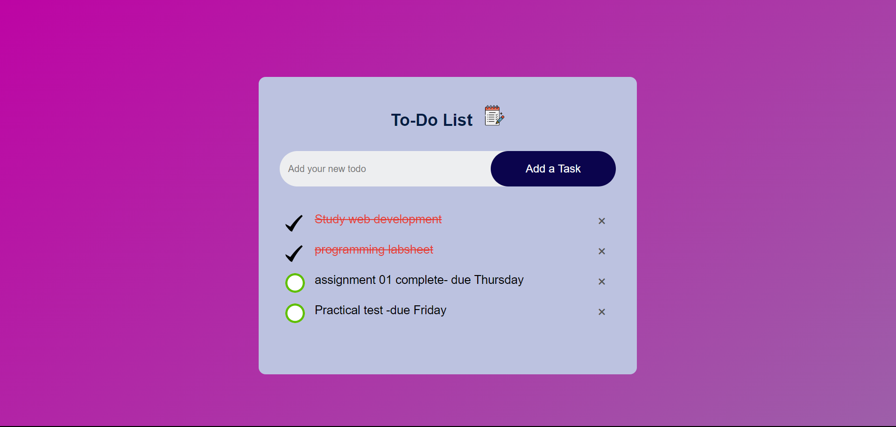

# JavaScript To-Do List

A simple to-do list web application built using HTML, CSS, and JavaScript.

## Table of Contents

- [Demo](#demo)
- [Features](#features)
- [Usage](#usage)
- [Contributing](#contributing)

## Demo

You can try out the live demo of the project [here](link-to-demo).

## Features

- Add new tasks to the to-do list.
- Mark tasks as completed.
- Delete tasks from the list.
- Local storage support to persist tasks across sessions.
